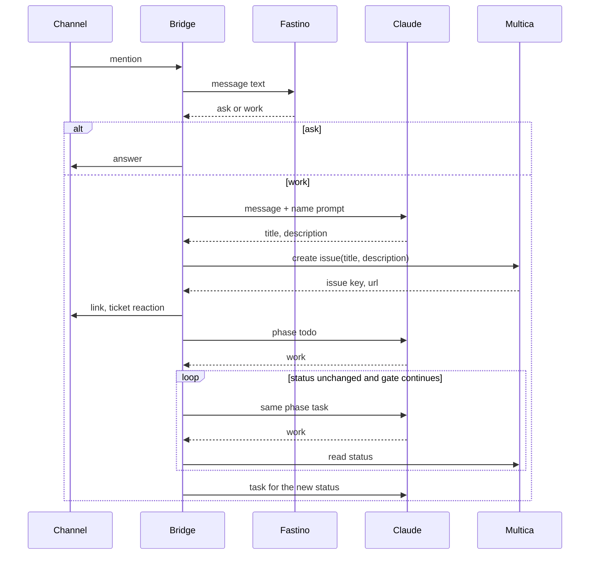

# buzz-acp task path

A mention arrives. Fastino classifies it. An ask is answered. A task is named by the agent, then created in Multica, then worked until the issue is in review or blocked.



```text
intake(message)
  kind = classify(message)          # Fastino: ask | work
  if kind == ask: queue answer
  if kind == work:
      draft = agent.write(message, name_prompt)
      require draft.title and draft.description
      issue = multica.create(draft.title, draft.description)
      link(issue, channel, root, event)
      react(ticket)
      agent.work(phase(todo))
      while status is unchanged and gate(status) continues:
          agent.work(phase(status))
          status = multica.status(issue)
      agent.work(phase(new status))
```

## Actors

| Actor | Role |
| --- | --- |
| Channel | Delivers the mention. Receives the answer, the issue link, and the ticket reaction. |
| Bridge | `buzz-acp`. Owns classification, the naming turn, issue creation, the link, and the work loop. |
| Fastino | `fastino/GLiNER-2.5-Decide` at `POST https://api.fastino.ai/v1/chat/completions`. Returns `ask` or `work`. |
| Claude | The ACP agent for this bridge. Writes the title and description, then does the work. |
| Multica | Stores the issue. The bridge reads status from here. |

One bridge belongs to one owner. The bridge does not list or choose among other Multica agents. `goal.multica.agent_id`, when set, is this bridge's own assignee. When it is empty, the issue is created with no assignee.

## Classifier output

```json
{ "label": "ask | work", "confidence": 0.0 }
```

`work` at confidence `>= 0.7` enters the task path. Every other result is an ask. An ask is queued and answered. No issue is created.

Fastino request:

```json
{
  "model": "fastino/GLiNER-2.5-Decide",
  "messages": [{ "role": "user", "content": "<message text>" }],
  "schema": {
    "classifications": [
      { "task": "intent", "labels": ["ask", "work"], "multi_label": false }
    ]
  },
  "include_confidence": true,
  "store": false
}
```

Header: `X-API-Key`. Read timeout is 300 seconds. HTTP 425, 429, and 503 are retried with `Retry-After` inside that budget.

## Naming output

Claude's reply is this object and nothing else:

```json
{
  "title": "string, one line, max 120",
  "description": "string"
}
```

Both fields are required. The bridge parses them from the reply. The raw mention is the input to Claude. It is not the title and it is not the description.

The naming prompt has a default. `BUZZ_ACP_SET__GOAL__GUARD__NAME_PROMPT` replaces that default for the whole instruction.

Default `NAME_PROMPT`:

```text
Write the Multica issue for the user request below.
Return one JSON object and no other text:
{"title":"one line, 120 characters maximum","description":"the work to do"}
The title names the work. The description states the work.
Do not copy the chat message into either field.
```

## Create body

`POST https://api.multica.ai/api/issues`

```json
{
  "title": "<draft.title>",
  "description": "<draft.description>",
  "status": "todo",
  "allow_duplicate": false
}
```

`assignee_type` and `assignee_id` are added only when `goal.multica.agent_id` is set. The value is `agent` and this bridge's id.

After create, three metadata keys are written:

| Key | Value |
| --- | --- |
| `buzz_channel` | channel id |
| `buzz_root` | root event id |
| `buzz_event` | source event id |

A failed metadata write deletes the issue. The channel message is not consumed.

On success the bridge posts the issue link and adds the ticket reaction `🎫` on the source message. `goal.guard.post_placement` chooses where that link goes, and the same value is appended to every phase task so the agent's updates use that place. `thread` replies on the mention's thread root. `channel` posts at the channel root, with no reply tag. The default is `thread`. `BUZZ_ACP_SET__GOAL__MULTICA__REACTION_CREATED` replaces that emoji. The seen reaction `👀` is also added. `👀` and the working reaction `💬` are cleared when the turn ends. `🎫` stays.

If the reply is missing either field, either field is empty, or either field is the chat message, the issue is not created. The bridge posts the create-failure notice and the same session answers the message as an ask. The naming reply is not posted.

## Work loop

The gate and the phase task are separate. The gate is the status class: `todo` and `in_progress` continue, `blocked` and `in_review` stop after their task, `done` releases, and `cancelled` stops with no task. The phase table chooses the words.

The prompt is the issue-instructions header, then the phase task, then the post-placement line. `{key}`, `{url}`, and `{status}` come from the issue. `{project_link}` and `{pr_link}` come from metadata `buzz_project_link` and `buzz_pr_link`. A missing key is empty.

```text
on create:
    send phase(todo)
on turn stop:
    status = multica.status(issue)
    if status is cancelled: stop
    if status != last phase:
        send phase(status)
        return
    if gate(status) is continue:
        if repeats == max_continuations: move to blocked and stop
        send phase(status)
        return
    stop
```

A phase change does not count toward `max_continuations`. A repeat of the same continue status does. The default cap is 5. A status with no table row uses the `in_progress` task when its gate continues, the `blocked` task when its gate explains, and the `done` task when its gate releases.

The `done` task is the completion output. Its default requires the Buzz project `link` and the Buzz PR `link`. Both are `buzz://` values from `buzz projects create` and `buzz pr open`.

Restart sweep: list issues in `todo` and `in_progress` that carry all three metadata keys, and feed those back to the agent. Issues without those keys are ignored.

## Environment

| Variable | Default | Replaces |
| --- | --- | --- |
| `BUZZ_ACP_SET__GOAL__GUARD__NAME_PROMPT` | the naming prompt above | the instruction Claude uses before create |
| `BUZZ_ACP_SET__GOAL__GUARD__POST_PLACEMENT` | `thread` | where the issue link and the work-loop updates are posted (`thread` or `channel`) |
| `BUZZ_ACP_SET__GOAL__PHASES__TODO` | research and plan | the task sent for `todo` |
| `BUZZ_ACP_SET__GOAL__PHASES__IN_PROGRESS` | do the work and record the Buzz links | the task sent for `in_progress` |
| `BUZZ_ACP_SET__GOAL__PHASES__IN_REVIEW` | review the project and the PR | the task sent for `in_review` |
| `BUZZ_ACP_SET__GOAL__PHASES__BLOCKED` | name the blocker | the task sent for `blocked` |
| `BUZZ_ACP_SET__GOAL__PHASES__DONE` | the completion record, including both Buzz links | the task sent for `done` |
| `BUZZ_ACP_SET__GOAL__GUARD__ISSUE_INSTRUCTIONS` | work the linked issue until release | the header prepended to every phase task |
| `BUZZ_ACP_SET__GOAL__GUARD__MAX_CONTINUATIONS` | `5` | the continue cap |
| `BUZZ_ACP_SET__GOAL__MULTICA__REACTION_CREATED` | `🎫` | the reaction added when the issue is created |

`{key}` and `{url}` are filled in on the header and the phase task. `{status}`, `{project_link}`, and `{pr_link}` are filled in on the phase task.
